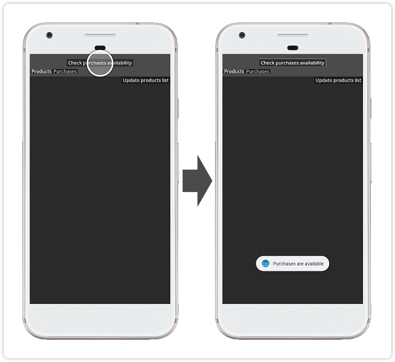
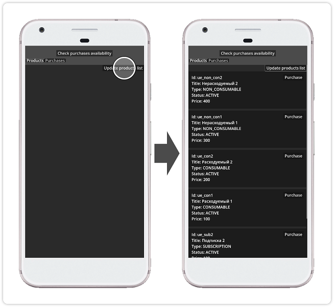
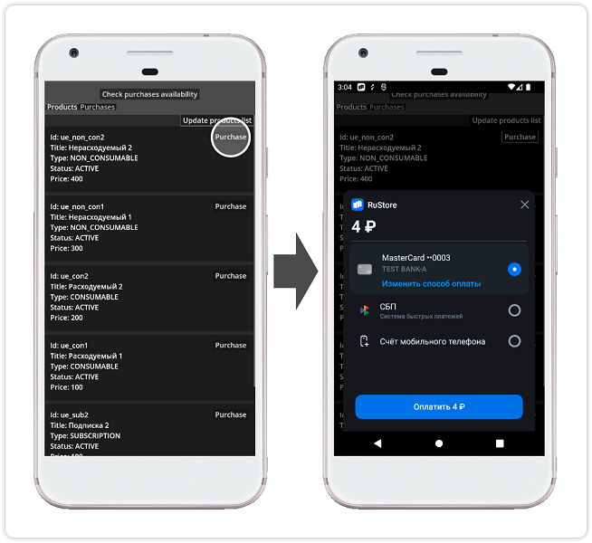

## RuStore Godot плагин для приема платежей через сторонние приложения

### [🔗 Документация разработчика](https://help.rustore.ru/rustore/for_developers/developer-documentation/sdk_payments/godot)

- [Условия работы платежей](#Условия-работы-платежей)
- [Подготовка требуемых параметров](#Подготовка-требуемых-параметров)
- [Настройка примера приложения](#Настройка-примера-приложения)
- [Сценарий использования](#Сценарий-использования)
- [Условия распространения](#Условия-распространения)
- [Техническая поддержка](#Техническая-поддержка)

### Условия работы платежей

Для работы проведения платежей необходимо соблюдение следующих условий.

1. На устройстве пользователя установлено приложение RuStore.

2. Пользователь авторизован в приложении RuStore.

3. Пользователь и приложение не должны быть заблокированы в RuStore.

4. Для приложения включена возможность покупок в системе [RuStore Консоль](https://console.rustore.ru/).

> ⚠️ Сервис имеет некоторые ограничения на работу за пределами РФ.

### Подготовка требуемых параметров

Для корректной настройки примера приложения необходимо подготовить следующие данные:

1. `consoleApplicationId` - код приложения из консоли разработчика RuStore (пример: https://console.rustore.ru/apps/123456, `consoleApplicationId` = 123456)

2. `applicationId` - уникальный идентификатор приложения в системе Android в формате обратного доменного имени (пример: ru.rustore.sdk.billingexample).

3. `productIds` - [подписки](https://www.rustore.ru/help/developers/monetization/create-app-subscription/) и [разовые покупки](https://www.rustore.ru/help/developers/monetization/create-paid-product-in-application/) доступные в вашем приложении.

4. `*.keystore` - файл ключа, который используется для [подписи и аутентификации Android приложения](https://www.rustore.ru/help/developers/publishing-and-verifying-apps/app-publication/apk-signature/).

###  Настройка примера приложения

Для проверки работы приложения вы можете воспользоваться функционалом [тестовых платежей](https://www.rustore.ru/help/developers/monetization/sandbox).

1. Выполните шаги раздела [“Сборка плагина”](../README.md). Собранные файлы (.aar и .gdap) будут автоматически скопированы в проект-пример.

2. Откройте godot проект в папке _“godot_example”_.

3. В файле _“godot_example / src / main.gd”_ в параметре "APPLICATION_ID" укажите `consoleApplicationId` - код приложения из консоли разработчика RuStore.

4. В файле _“godot_example / src / main.gd”_ в параметре "PRODUCT_IDS" перечислите `productIds` - [подписки](https://www.rustore.ru/help/developers/monetization/create-app-subscription/) и [разовые покупки](https://www.rustore.ru/help/developers/monetization/create-paid-product-in-application/) доступные в вашем приложении.

5. Выполните установку шаблона сборки Android (Проект → Установить шаблон сборки Android...).

6. Скопируйте с заменой содержимое папки _“godot_example / android / build_example”_ в папку _“godot_example / android / build”_.

7. Добавьте пресет сборки Android (Проект → Экспорт... → Добавить... → Android).

8. В пресете сборки Android в списке "Плагины" отметьте плагины “Ru Store Godot Billing” и “Ru Store Godot Core”

9. Настройте разделы “Хранилище ключей”, и “Пакет” под параметры вашего приложения в RuStore. Подробная информация о публикации приложений в RuStore доступна на странице [help](https://help.rustore.ru/rustore/for_developers/publishing_and_verifying_apps).

10. Выполните сборку проекта командой “Экспорт проекта...” и проверьте работу приложения.

### Сценарий использования

#### Проверка доступности работы с платежами

Начальный экран приложения не содержит загруженных данных и уведомлений. Тап по кнопке `Check purchases availability` выполняет [проверку доступности платежей](https://www.rustore.ru/help/sdk/payments/checkpurchasesavailability)

#### Получение списка продуктов

Тап по кнопке `Update products list` выполняет получение и отображение [списка продуктов](https://www.rustore.ru/help/sdk/payments/getproducts)

#### Покупка продукта

Тап по кнопке `Purchase` выполняет запуск сценария [покупки продукта](https://www.rustore.ru/help/sdk/payments/purchaseproduct) с отображением шторки выбора метода оплаты.

#### Условия распространения

Данное программное обеспечение, включая исходные коды, бинарные библиотеки и другие файлы распространяется под лицензией MIT. Информация о лицензировании доступна в документе [MIT-LICENSE](../MIT-LICENSE.txt).

### Техническая поддержка

Дополнительная помощь и инструкции доступны на странице [help.rustore.ru](https://help.rustore.ru/) и по электронной почте [support@rustore.ru](mailto:support@rustore.ru).
