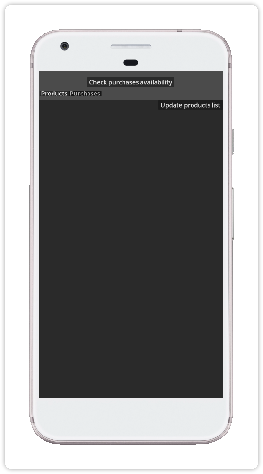
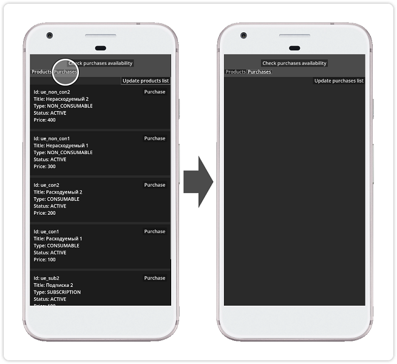
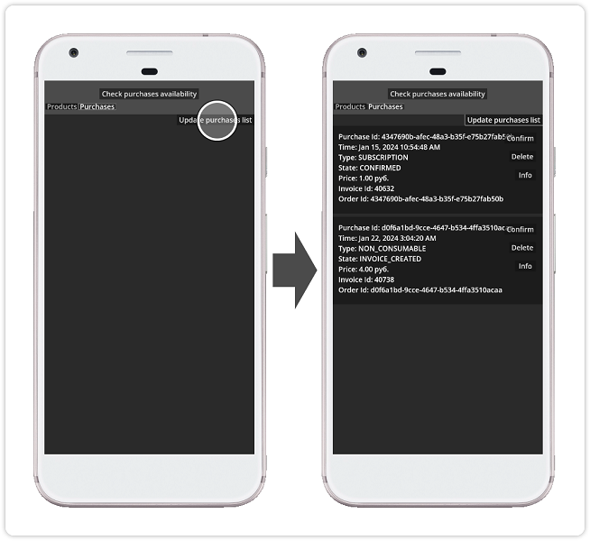
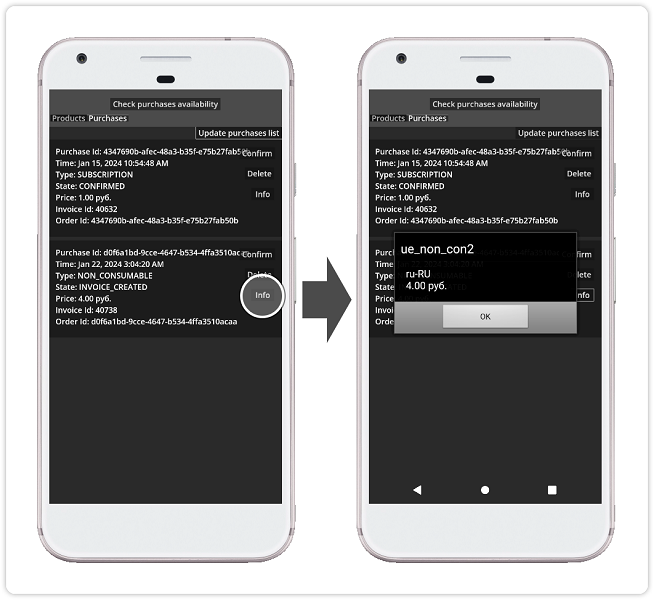
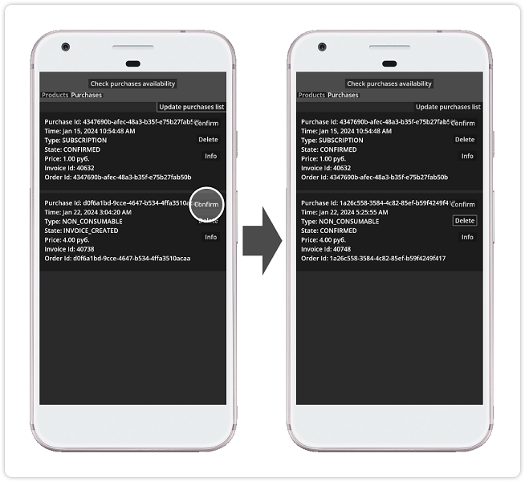
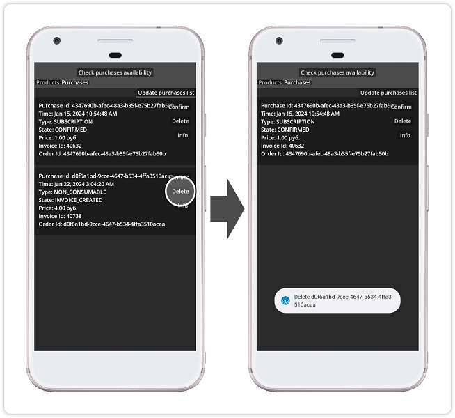

## RuStore Godot плагин для приема платежей через сторонние приложения

### [🔗 Документация разработчика](https://help.rustore.ru/rustore/for_developers/developer-documentation/sdk_payments/godot)

- [Общие сведения](#общие-сведения)
- [Настройка примера приложения](#настройка-примера-приложения)
- [Сборка примера приложения](#сборка-примера-приложения)
- [Сценарий использования](#сценарий-использования)
- [Техническая поддержка](#техническая-поддержка)

### Общие сведения

Для работы проведения платежей необходимо соблюдение следующих условий.

1. На устройстве пользователя установлено приложение RuStore.

2. Пользователь авторизован в приложении RuStore.

3. Пользователь и приложение не должны быть заблокированы в RuStore.

4. Для приложения включена возможность покупок в системе [RuStore Консоль](https://console.rustore.ru/).

### Настройка примера приложения

Для проверки работы приложения вы можете воспользоваться функционалом [тестовых платежей](https://www.rustore.ru/help/developers/monetization/sandbox).

1. В файле _“godot_example / src / main.gd”_ в параметре "APPLICATION_ID" укажите код приложения из консоли разработчика RuStore. Пример: адрес страницы приложения https://console.rustore.ru/apps/123456, код приложения - 123456.

2. В файле _“godot_example / src / main.gd”_ в параметре "PRODUCT_IDS" перечислите [подписки](https://www.rustore.ru/help/developers/monetization/create-app-subscription/) и [разовые покупки](https://www.rustore.ru/help/developers/monetization/create-paid-product-in-application/) доступные в вашем приложении.

### Сборка примера приложения

1. Выполните шаги раздела [“Сборка плагина”](../README.md). Собранные файлы (.aar и .gdap) будут автоматически скопированы в проект-пример.

2. Откройте godot проект в папке _“godot_example”_.

3. Выполните установку шаблона сборки Android (Проект → Установить шаблон сборки Android...).

4. Скопируйте с заменой содержимое папки _“godot_example / android / build_example”_ в папку _“godot_example / android / build”_.

5. Добавьте пресет сборки Android (Проект → Экспорт... → Добавить... → Android).

6. В пресете сборки Android в списке "Плагины" отметьте плагины “Ru Store Godot Billing” и “Ru Store Godot Core”

7. Настройте разделы “Хранилище ключей”, “Версия” и “Пакет” под параметры вашего приложения в RuStore. Подробная информация о публикации приложений в RuStore доступна на странице [help](https://help.rustore.ru/rustore/for_developers/publishing_and_verifying_apps).

8. Выполните сборку проекта командой “Экспорт проекта...” и проверьте работу приложения.

### Сценарий использования

#### Запуск приложения

Начальный экран приложения не содержит загруженных данных и уведомлений.

#### Проверка доступности работы с платежами

Тап по кнопке `Check purchases availability` выполняет [проверку доступности платежей](https://www.rustore.ru/help/sdk/payments/checkpurchasesavailability)

#### Получение списка продуктов

Тап по кнопке `Update products list` выполняет получение и отображение [списка продуктов](https://www.rustore.ru/help/sdk/payments/getproducts)

#### Покупка продукта

Тап по кнопке `Purchase` выполняет запуск сценария [покупки продукта](https://www.rustore.ru/help/sdk/payments/purchaseproduct) с отображением шторки выбора метода оплаты.

#### Получение списка покупок

Тап по вкладке `Purchases` выполняет переход к экрану покупок.

Тап по кнопке `Update purchases list` выполняет получение и отображение [списка покупок](https://www.rustore.ru/help/sdk/payments/getpurchases)

#### Получение сведений о покупке

Тап по кнопке `Info` выполняет сценарий [получения сведений о покупке](https://www.rustore.ru/help/sdk/payments/getpurchaseinfo).

#### Подтверждение покупки

Тап по кнопке `Confirm` выполняет сценарий [подтверждения покупки](https://www.rustore.ru/help/sdk/payments/confirmpurchase). В случае успешнго выполнения сценария статус покупки меняется на `CONFIRMED`.

#### Отмена покупки

Тап по кнопке `Delete` выполняет сценарий [отмены покупки](https://www.rustore.ru/help/sdk/payments/deletepurchase).

### Техническая поддержка

Дополнительная помощь и инструкции доступны на странице [help.rustore.ru](https://help.rustore.ru/).
