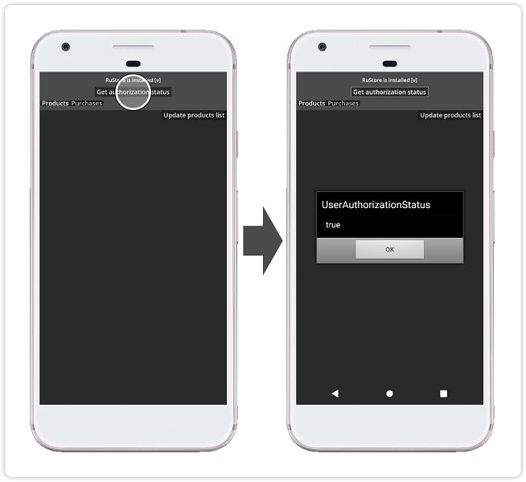
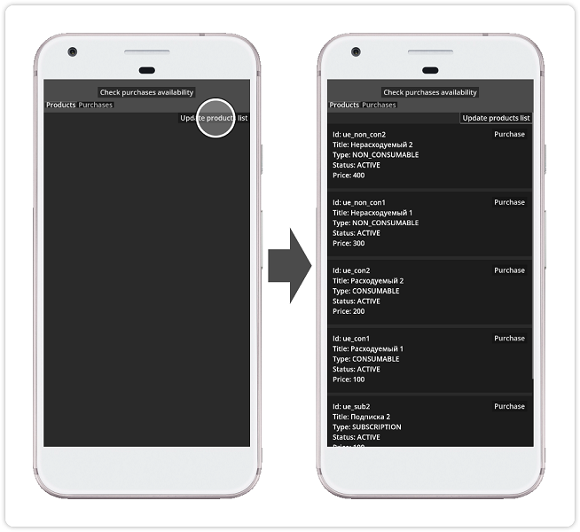
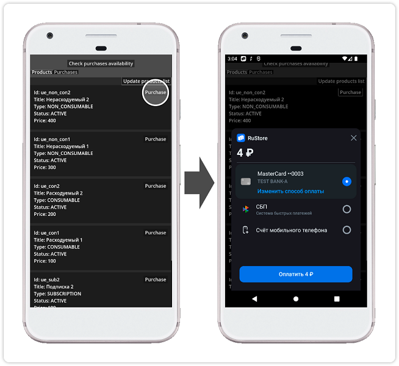

## RuStore Godot плагин для приема платежей через сторонние приложения

### [🔗 Документация разработчика][10]

- [Условия работы платежей](#Условия-работы-платежей)
- [Подготовка требуемых параметров](#Подготовка-требуемых-параметров)
- [Настройка примера приложения](#Настройка-примера-приложения)
- [Сценарий использования](#Сценарий-использования)
- [Условия распространения](#Условия-распространения)
- [Техническая поддержка](#Техническая-поддержка)

### Условия работы платежей

Для работы проведения платежей необходимо соблюдение следующих условий:

1. На устройстве пользователя установлено приложение RuStore.

2. Пользователь авторизован в приложении RuStore.

3. Пользователь и приложение не должны быть заблокированы в RuStore.

4. Для приложения включена возможность покупок в системе [RuStore Консоль](https://console.rustore.ru/).

> ⚠️ Сервис имеет ограничения на работу за пределами РФ.

### Подготовка требуемых параметров

Для корректной настройки примера приложения необходимо подготовить следующие данные:

1. `consoleApplicationId` - код приложения из консоли разработчика RuStore (пример: https://console.rustore.ru/apps/123456, `consoleApplicationId` = 123456). Подробная информация о публикации приложений в RuStore доступна на странице [help](https://help.rustore.ru/rustore/for_developers/publishing_and_verifying_apps).

2. `productIds` - [подписки](https://www.rustore.ru/help/developers/monetization/create-app-subscription/) и [разовые покупки](https://www.rustore.ru/help/developers/monetization/create-paid-product-in-application/) доступные в вашем приложении.

3. `applicationId` - уникальный идентификатор приложения в системе Android в формате обратного доменного имени (пример: ru.rustore.sdk.example).

4. `*.keystore` - файл ключа, который используется для [подписи и аутентификации Android приложения](https://www.rustore.ru/help/developers/publishing-and-verifying-apps/app-publication/apk-signature/).

###  Настройка примера приложения

Для проверки работы приложения вы можете воспользоваться функционалом [тестовых платежей](https://www.rustore.ru/help/developers/monetization/sandbox).

> ⚠️ Библиотеки плагинов в репозитории собраны для Godot Engine 4.2.1. Если вы используете другую версию Godot Engine, выполните шаги раздела [_"Пересборка плагина"_](../README.md).

1. Откройте godot проект в папке _“godot_example”_.

2. В файле _“godot_example / src / main.gd”_ в параметре "APPLICATION_ID" укажите `consoleApplicationId` - код приложения из консоли разработчика RuStore.

3. В файле _“godot_example / src / main.gd”_ в параметре "PRODUCT_IDS" перечислите `productIds` - [подписки](https://www.rustore.ru/help/developers/monetization/create-app-subscription/) и [разовые покупки](https://www.rustore.ru/help/developers/monetization/create-paid-product-in-application/) доступные в вашем приложении.

4. Выполните установку шаблона сборки Android (Проект → Установить шаблон сборки Android...).

5. Скопируйте с заменой содержимое папки _“godot_example / android / build_example”_ в папку _“godot_example / android / build”_.

6. Добавьте пресет сборки Android (Проект → Экспорт... → Добавить... → Android).

7. В пресете сборки Android в списке "Плагины" отметьте плагины “Ru Store Godot Billing” и “Ru Store Godot Core”.

8. Настройте раздел “Хранилище ключей”, указав расположение и параметры ранее подготовленного файла `*.keystore`.

9. Настройте раздел “Пакет”, указав `applicationId` в поле “Уникальное Имя”.

10. Выполните сборку проекта командой “Экспорт проекта...” и проверьте работу приложения.

### Сценарий использования

#### Проверка статуса авторизации у пользователя

Начальный экран приложения не содержит загруженных данных и уведомлений. Тап по кнопке `Get authorization status` выполняет [проверку статуса авторизации][20].

#### Получение списка продуктов

Тап по кнопке `Update products list` выполняет получение и отображение [списка продуктов][30].

#### Покупка продукта

Тап по кнопке `Purchase` выполняет запуск сценария [покупки продукта][40] с отображением шторки выбора метода оплаты.

### Условия распространения

Данное программное обеспечение, включая исходные коды, бинарные библиотеки и другие файлы распространяется под лицензией MIT. Информация о лицензировании доступна в документе [MIT-LICENSE](../MIT-LICENSE.txt).

### Техническая поддержка

Дополнительная помощь и инструкции доступны на странице [rustore.ru/help/](https://www.rustore.ru/help/) и по электронной почте [support@rustore.ru](mailto:support@rustore.ru).

[10]: https://www.rustore.ru/help/sdk/payments/godot/10-0-0
[20]: https://www.rustore.ru/help/sdk/payments/godot/10-0-0#getauthorizationstatus
[30]: https://www.rustore.ru/help/sdk/payments/godot/10-0-0#getproducts
[40]: https://www.rustore.ru/help/sdk/payments/godot/10-0-0#purchaseproduct
